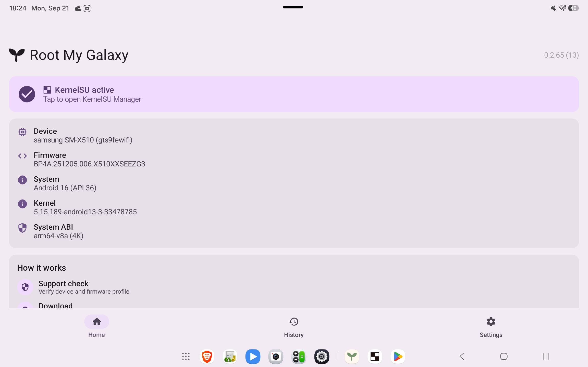
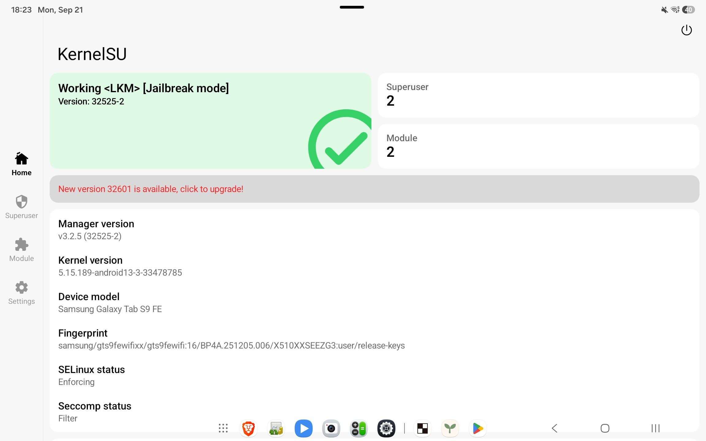

# Root My Galaxy Tab S9FE Payloads

This repository contains the Samsung Galaxy Tab S9 FE X510XXSEEZG3 build specific native side of
[Root My Galaxy](https://github.com/hmd-msrf-k/Root-My-Galaxy):

- exact firmware profiles and offsets;
- the app-domain CVE-2026-43499 exploit source and compiled payload;
- the app bootstrap helper source;
- the verified KernelSU late-load build artifacts;
- the support feed consumed by the application.

It intentionally does not contain Android application source code.

## Supported payloads

| Payload | Compatible build | Kernel version | Status |
| --- | --- | --- | --- |
| `gts9fewifi-X510XXSEEZG3` | X510XXSEEZG3 | `5.15.189` | Device-tested |

Schema version 3 keeps each exploit and KernelSU artifact once. Its flat
`models` and `kernelVersions` arrays define runtime compatibility. See
[`support/README.md`](support/README.md) for the matching rules.

The port is based on the exploit source published at
<https://github.com/NebuSec/CyberMeowfia/tree/main/IonStack/CVE-2026-43499/exploit>.

## Feed delivery

Root My Galaxy resolves the payload repository's current commit first and
fetches `support/targets-v3.json` and every artifact from that immutable
commit. Per-artifact SHA-256 fields and manifest signatures are not part of
schema version 3.

## Build

```sh
make TARGET=gts9fewifi-X510XXSEEZG3 ANDROID_NDK_HOME=/path/to/android-ndk
```

Outputs:

```text
build/<profile>/cve-2026-43499
build/<profile>/cve-2026-43499-app.so
build/<profile>/cve-2026-43499-root
```

The release app payload is built with:

```sh
make TARGET=gts9fewifi-X510XXSEEZG3 ANDROID_NDK_HOME=/path/to/android-ndk release
```

The complete firmware-to-profile procedure is recorded in
[`docs/PORTING.md`](docs/PORTING.md). Samsung-specific KernelSU changes and
versioned artifacts are documented in [`kernelsu/README.md`](kernelsu/README.md).

Use only on devices you own or are explicitly authorized to test.

## Screenshots


